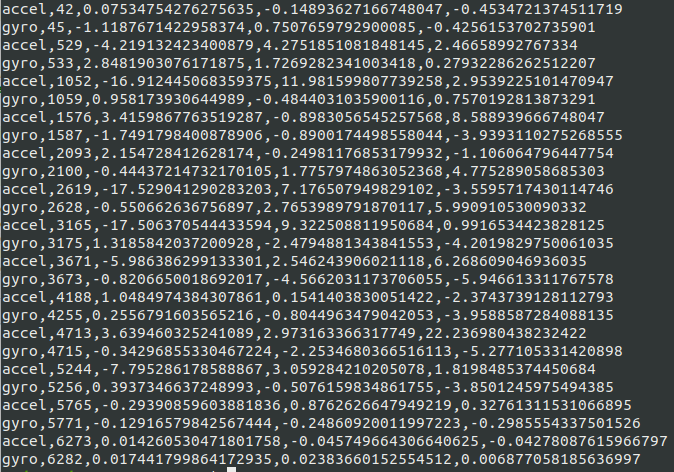

# SensorLogger
SensorLogger is a simple sensor data logger for Wear OS. It works by transmitting sensor readings from a Wear OS smartwatch to a
connected Android phone at a custom sampling rate and creating a log file for post-processing. \
All logs can be found at __/storage/emulated/0/Android/data/com.jhj37.sensorlogger/files__ and can be pulled using ADB. \
Currently, SensorLogger is able to track accelerometer readings, gyroscope readings, or both. 

__Note on usage:__ Attempting to use the application before connecting the two devices can lead to crashes. Also, recording will stop when either the watch's or the phone's application is paused. 

A sample log is shown below: each log line consists of a sensor label, measurement time in ms, and the sensor data. 

 
